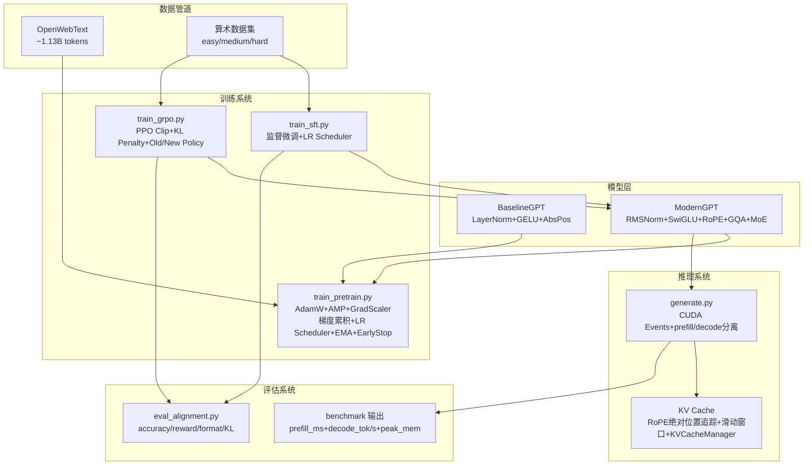

# nanoGPT-Modern

一个**端到端的轻量级大语言模型训练-推理-对齐全栈框架**，基于 Andrej Karpathy 的 [nanoGPT](https://github.com/karpathy/nanoGPT) 思想构建，在 **~50M 参数** 规模下完整验证现代 Transformer 组件的架构增益与效率 trade-off。

---

## 系统设计理念

本项目的设计哲学是 **"对照实验的可信度优先于演示性的炫技"**。每一处架构改造都配有严格的控制变量对比（Baseline vs Modern），每一处推理优化都有独立的消融测量（cache vs no-cache），每一个训练特性都有可配置开关。代码组织以模块化为原则——模型、训练、推理、数据、工具各自独立，通过统一的 Config 对象串接。

### 三大核心阶段

```
预训练（架构改造）        推理加速               RL 对齐
─────────────────      ────────────          ─────────
BaselineGPT   ModernGPT   No-Cache  KV Cache    SFT-only   GRPO-G4
   │             │           │         │           │          │
   └──loss对比──┘           └─吞吐消融─┘           └──acc对比──┘
```

### 系统架构图



---

## 模型架构设计

### 双轨制对比

项目同时提供两个模型，共享相同的训练超参、数据顺序、随机种子，确保对比的单一变量原则：

| 维度           | BaselineGPT                             | ModernGPT                                   |
| -------------- | --------------------------------------- | ------------------------------------------- |
| 归一化         | LayerNorm (含 bias，减均值+除标准差)    | **RMSNorm** (无 bias，仅除 RMS)             |
| 前馈网络       | GELU FFN (4× 扩展，`8d²` 参数)          | **SwiGLU** (gate/up/down，`3d×hidden` 参数) |
| 位置编码       | 可学习绝对位置 Embedding                | **RoPE** 旋转位置编码                       |
| Attention 实现 | SDPA (默认) / 手动 causal mask (可切换) | SDPA (FlashAttention 自动分发)              |
| KV Cache       | —                                       | **原生支持** + KVCacheManager + 滑动窗口    |
| GQA            | —                                       | **支持** (`n_kv_head` ≤ `n_head`)           |
| MoE FFN        | —                                       | **支持** (`num_experts` ≥ 1, top-1 gating)  |
| Pre/Post-Norm  | `norm_position="pre"` / `"post"`        | `norm_position="pre"` / `"post"`            |
| Weight Tying   | wte ↔ lm_head                           | wte ↔ lm_head                               |

### 参数量精确对齐

| 配置 (9L/512D)         | 总参数量 | 非嵌入参数 | KV Cache (B/tok) |
| ---------------------- | -------- | ---------- | ---------------- |
| BaselineGPT            | 54.6M    | 28.4M      | N/A              |
| ModernGPT MHA (n_kv=8) | 54.0M    | 28.3M      | 18,432           |
| ModernGPT GQA-4KV      | 51.7M    | 26.0M      | **9,216** (↓50%) |
| ModernGPT GQA-2KV      | 50.5M    | 24.8M      | **4,608** (↓75%) |

### ModernGPTConfig 完整参数

```python
ModernGPTConfig(
    vocab_size=50257,         # 词表大小
    block_size=1024,          # 最大上下文长度
    n_layer=12,               # Transformer 层数
    n_head=8,                 # Query 注意力头数
    n_embd=512,               # 隐藏维度
    n_kv_head=None,           # KV 头数 (None=n_head, 即 MHA; 设为 2/4 启用 GQA)
    intermediate_size=None,   # SwiGLU 隐层维度 (None=自动, 8d/3 向上取 128 的倍数)
    dropout=0.0,              # Dropout 概率
    norm_position="pre",      # "pre" (LLaMA) 或 "post" (GPT-2 原始)
    num_experts=1,            # MoE Expert 数量 (1=稠密 SwiGLU, >1=top-1 gating)
)
```

### 技术选型深度说明

**GQA (Grouped Query Attention)**：源自 [GQA: Training Generalized Multi-Query Transformer Models (Ainslie et al., 2023)](https://arxiv.org/abs/2305.13245)。通过减少 K/V 头数降低推理时 KV Cache 显存，在几乎不损失质量的前提下实现 50-75% 的缓存节省。本项目通过 `n_kv_head` 参数控制，`n_head % n_kv_head == 0` 约束保证 Q 头均匀分组。

**SwiGLU**：源自 [GLU Variants Improve Transformer (Shazeer, 2020)](https://arxiv.org/abs/2002.05202)。用门控线性单元替代标准 FFN，`intermediate_size` 按 `8d/3` 计算并向上取 128 的倍数（9 层 512 dim 下为 1408），兼顾 GPU 内存对齐和与 Baseline GELU FFN 的参数对齐。

**RoPE (Rotary Position Embedding)**：源自 [RoFormer: Enhanced Transformer with Rotary Position Embedding (Su et al., 2021)](https://arxiv.org/abs/2104.09864)。将位置信息编码为 Q/K 向量的旋转变换，天然支持相对位置建模和序列外推。本项目通过 `start_pos` 绝对位置追踪 + 懒更新缓存保证 cache/no-cache 的 100% bit-wise 一致。

**Pre/Post-Norm**：Pre-Norm (`x = x + Attn(Norm(x))`) 是现代 LLaMA 风格，最终 loss 更优但需要 warmup；Post-Norm (`x = Norm(x + Attn(x))`) 是 GPT-2 原始风格，训练更稳定但收敛稍慢。通过 `norm_position` 一键切换，方便做消融实验。

**MoE FFN (实验性)**：SwiGLU 可扩展为 top-1 gating 的 Mixture of Experts。每个 expert 拥有独立的 gate/up/down 投影，router 输出 softmax 权重。单 token 的 forward FLOPs 与稠密 SwiGLU 相同（仅一个 expert 激活），但总参数量随 `num_experts` 线性增长。

---

## KV Cache 推理加速系统

### 问题定义

自回归生成中，每生成一个新 token 都需要对整个历史序列做 Attention。无缓存时第 N 步的 forward 计算量为 O(N²)，其中绝大多数是重复计算（历史 token 的 K/V 从未改变）。

### 解决方案

```
无 KV Cache (BaselineGPT):              有 KV Cache (ModernGPT):
每步 forward 全序列 ── O(N²)              Prefill: 一次性计算 prompt ── O(N²)
                                         Decode:  每步只算 1 个 token 的 K/V ── O(N)
```

**核心数据流**：

```
Step 0 (Prefill):  prompt → [Q₀,Q₁,Q₂] [K₀,K₁,K₂] [V₀,V₁,V₂]
                    缓存 KV = [K₀,K₁,K₂], [V₀,V₁,V₂]

Step 1 (Decode):    token₃ → Q₃
                    拼接: K₀K₁K₂K₃, V₀V₁V₂V₃
                    Attention(Q₃, K_all, V_all) → token₄
                    缓存 KV = [K₀..K₄], [V₀..V₄]   (追加)
```

### 关键技术细节

**RoPE 绝对位置追踪**（`start_pos` 机制）：缓存的 K 在加入时已经应用了对应位置的 RoPE 旋转。当滑动窗口截断左侧 KV 时，`start_pos` 同步增加 `trim` 量，确保后续 token 的 RoPE 角度基于真实绝对索引计算。

**滑动窗口**：当 `cache_len > block_size` 时自动丢弃最早的 KV 块，位置基准同步更新，避免 OOM 和位置编码溢出。

**RoPE 缓存**：`RotaryEmbedding` 首次前向时预计算 `max_seq_len` 长的 cos/sin 表，后续调用按索引切片，消除 token-by-token 生成时的重复三角函数计算。

**因子化 generate**：将生成过程显式分离为 prefill（一次性处理 prompt）和 decode（逐 token 循环），消除 per-token 条件分支，减少 `torch.cat` 导致的 GPU 内存重分配。

### Benchmark 设计

`inference/generate.py` 使用 **CUDA Events** 精确计时（微秒级），分离测量：

| 指标           | 含义                    | 测量方式                            |
| -------------- | ----------------------- | ----------------------------------- |
| `prefill_ms`   | Prompt 编码耗时         | ev0 → ev1 的时间差                  |
| `decode_ms`    | 逐 token 生成耗时       | ev1 → ev2 的时间差                  |
| `decode_tok_s` | **纯 decode 阶段** 吞吐 | `max_new_tokens / (decode_ms/1000)` |
| `total_tok_s`  | 端到端吞吐 (含 prefill) | `max_new_tokens / (total_ms/1000)`  |
| `peak_mem_mb`  | 峰值显存                | `torch.cuda.max_memory_allocated`   |

```bash
python inference/generate.py \
    --checkpoint out/pretrain/best_ckpt.pt \
    --max_new_tokens 400 500 --num_samples 30 \
    --output_json out/bench.json
```

### KVCacheManager

```python
from model.kv_cache_utils import KVCacheManager

cache = KVCacheManager.from_config(config)
cache.init_cache(batch_size, device, dtype)
# decode loop:
cache.update(layer_idx, new_k, new_v)
```

---

## 训练系统设计

### 预训练管线 (`train_pretrain.py`)

完整工业级训练特性，全部通过 CLI 控制：

```
训练循环
├── Mixed Precision (torch.amp.autocast)
│   └── fp16 → GradScaler 防梯度下溢; bf16 → 无需
├── 梯度累积 (`--gradient_accumulation_steps N`)
│   └── 每 N 个 micro-batch 做一次 optimizer.step()
├── LR Scheduler (`--lr_schedule`)
│   ├── cosine:  linear warmup → cosine decay (默认)
│   ├── linear:  linear warmup → linear decay
│   ├── wsd:     Warmup → Stable → cosine Decay (Chinchilla 风格)
│   └── constant: linear warmup → 恒定 LR
├── EMA (`--use_ema --ema_decay 0.999`)
│   └── 影子权重指数平滑，eval 时 swap in/out
├── Early Stopping (`--early_stopping_patience N`)
│   └── val loss 连续 N 次未改善 → 自动停止
├── DDP 多卡支持
├── Checkpoint (模型 + 优化器 + iter + best_val_loss)
└── 日志 (wandb / TensorBoard / console 三后端)
```

**参数速查**：

| 参数                              | 默认值  | 说明                                    |
| --------------------------------- | ------- | --------------------------------------- |
| `--model`                         | modern  | `baseline` 或 `modern`                  |
| `--n_layer / --n_head / --n_embd` | 9/8/512 | 模型结构                                |
| `--n_kv_head`                     | None    | GQA KV 头数 (None=MHA)                  |
| `--batch_size`                    | 12      | 每 GPU 的 micro-batch                   |
| `--gradient_accumulation_steps`   | 1       | 累积步数 (effective batch = bs × accum) |
| `--lr_schedule`                   | cosine  | `cosine`/`linear`/`wsd`/`constant`      |
| `--use_ema`                       | False   | 启用 EMA                                |
| `--early_stopping_patience`       | 0       | 早停容忍度 (0=禁用)                     |

### SFT 监督微调 (`train_sft.py`)

支持 `--lr_schedule` 和 `--min_lr`，默认 cosine 调度 + 5% warmup：

```bash
python training/train_sft.py \
    --init_from out/pretrain/best_ckpt.pt \
    --lr_schedule cosine --min_lr 1e-5 --epochs 3 \
    --variant sft-only  # 或 sft-continued (更长训练)
```

### GRPO 强化学习对齐 (`train_grpo.py`)

完整的 Group Relative Policy Optimization 实现，无需 Critic 网络：

```
对每个 prompt:
  1. 从当前 policy 采样 G 个 response (eval 模式, dropout=0)
  2. 规则奖励函数打分 → [r₁, r₂, ..., rG]
  3. 组内优势: Aᵢ = (rᵢ - mean(r)) / (std(r) + ε)
  4. 记录 old_logprob (detach, 供后续 ratio 计算)
  5. 优化阶段重新计算 new_logprob (train 模式)
  6. ratio = exp(new - old)
  7. PPO loss = -min(ratio × A, clip(ratio, 1-ε, 1+ε) × A)
  8. total loss = PPO_loss + β × KL(ref || policy)
```

**健壮性设计**：初始化时自动检查 `dropout` 参数。若 `dropout > 0`，发出 `UserWarning`（eval 和 train 模式下的 old/new logprob 会因 dropout mask 不一致产生偏差）。

```bash
python training/train_grpo.py \
    --init_from out/sft/final.pt \
    --ref_from out/sft/final.pt \
    --group_size 4 --num_steps 1000 --beta 0.04 --eps 0.2
```

---

## 生成策略

`ModernGPT.generate()` 支持完整的采样参数矩阵，同时兼容 no-cache 和 cache 模式：

```python
model.generate(
    idx,                          # prompt token IDs [1, prompt_len]
    max_new_tokens=500,           # 生成 token 数
    temperature=0.8,              # 温度 (>0 缩放, =0 贪婪)
    top_k=50,                     # Top-K 过滤
    top_p=0.95,                   # Nucleus sampling (核采样)
    repetition_penalty=1.1,       # 重复惩罚 (>1.0 抑制已生成 token)
    use_cache=True,               # 启用 KV Cache
)
```

**top_p 实现**：按概率降序排列，累积概率超过阈值的 token 被置为 `-inf`，保留至少 1 个 token。  
**repetition_penalty 实现**：对已出现在生成序列中的 token，其 logits 除以 `repetition_penalty` 降低重选概率。

---

## 数据管道

### OpenWebText 流式加载 (`data/openwebtext.py`)

```
预处理 (prepare.py)                   训练时读取 (openwebtext.py)
───────────────────                   ──────────────────────────
raw text → tiktoken encode            np.memmap → 按 block_size 切 chunk
       → np.uint16/32 binary          → buffer shuffle (每 10000 chunk)
       → .bin + .idx (元信息)          → resume_offset 断点续接
                                     → DocBoundaryDataset (可选)
```

**自动 dtype**：`prepare.py` 根据 tokenizer 词表大小自动选择 `uint16`（≤65535）或 `uint32`（>65535），元信息写入 `.idx` 文件。

**DocBoundaryDataset**：在 EOT token 处截断 chunk，防止一个文档的结尾与下一个文档的开头拼接产生语义噪声。

**数据验证** (`data/validate.py`)：

```bash
python data/validate.py data/openwebtext/train.bin
# → token 范围、词表覆盖、EOT 频率、top-20 histogram、随机解码样本
```

### 算术数据集 (`data/arithmetic.py`)

三档难度，训练时动态生成，中高难度含多样化模板：

| 难度   | 数字范围 | 模板数 | 示例                           |
| ------ | -------- | ------ | ------------------------------ |
| easy   | 0–100    | 4      | `23 + 45`, `100 / 7`           |
| medium | 0–1000   | 2 类   | `(a+b)*c`, `a+b*c-d/e`         |
| hard   | 0–10000  | 5      | 嵌套括号、`a**b%c`、双组运算等 |

`safe_eval` 区分除零、溢出和一般异常，确保数据质量。

---

## 工程特性汇总

| 特性                     | 实现在                               | 说明                                    |
| ------------------------ | ------------------------------------ | --------------------------------------- |
| Flash Attention 后端诊断 | `ModernGPT._log_attention_backend()` | 模型初始化时打印实际 SDPA 内核          |
| GradScaler               | `train_pretrain.py`                  | fp16 时激活，bf16/CPU 时自动禁用        |
| RoPE 缓存                | `RotaryEmbedding._ensure_cache()`    | 懒更新，首次 forward 缓存全表           |
| 因子化 generate          | `ModernGPT.generate()`               | prefill/decode 分离，消除条件分支       |
| Config 序列化            | `ModernGPTConfig.to_dict/from_dict`  | JSON 兼容，向后兼容旧 checkpoint        |
| Dropout 守卫             | `GRPOTrainer.__init__`               | dropout>0 时发出 UserWarning            |
| 日志双后端               | `utils/logging.py`                   | wandb + TensorBoard，初始化失败自动降级 |
| 检查点完整性             | `utils/checkpoint.py`                | 模型 + 优化器 + iter + best_val_loss    |
| 可复现性                 | 全局 seed                            | torch/numpy/random 统一 seed=1337       |

---

## 快速开始

### 环境

```bash
pip install torch numpy tiktoken tensorboard wandb datasets pyyaml
```

### 完整流程

```bash
# 1. 数据准备
python data/prepare.py --split train
python data/prepare.py --split val
python data/validate.py data/openwebtext/train.bin

# 2. 预训练 (ModernGPT, GQA-4KV, cosine LR, EMA, 梯度累积)
python training/train_pretrain.py --model modern \
    --n_layer 9 --n_head 8 --n_embd 512 --n_kv_head 4 \
    --batch_size 12 --gradient_accumulation_steps 4 \
    --lr_schedule cosine --use_ema --early_stopping_patience 5 \
    --max_iters 18000 --device cuda

# 3. 推理消融 Benchmark
python inference/generate.py \
    --checkpoint out/pretrain/best_ckpt.pt \
    --max_new_tokens 400 500 --num_samples 30 \
    --output_json out/bench.json

# 4. SFT 监督微调
python training/train_sft.py \
    --init_from out/pretrain/best_ckpt.pt \
    --lr_schedule cosine --min_lr 1e-5 --epochs 3

# 5. GRPO 对齐
python training/train_grpo.py \
    --init_from out/sft/final.pt --ref_from out/sft/final.pt \
    --group_size 4 --num_steps 1000 --beta 0.04

# 6. 评估
python evaluation/eval_alignment.py \
    --checkpoint out/grpo/best.pt --ref_checkpoint out/sft/final.pt
```

---

## 实验指标目标

| 阶段    | 指标                                      | 目标                                    |
| ------- | ----------------------------------------- | --------------------------------------- |
| 预训练  | ModernGPT val loss vs Baseline @ 18k iter | **↓2.29%** (3.9126 → 3.8229)            |
| 推理    | KV Cache 吞吐                             | 长序列 (>400 tokens) 正向提升           |
| GQA     | KV Cache 显存 vs MHA                      | **↓50%** (GQA-4KV) / **↓75%** (GQA-2KV) |
| SFT     | Format pass rate                          | easy 100%, medium ≥ 96%                 |
| GRPO-G4 | Accuracy vs SFT-only                      | easy +19.1 pts, medium +2.8 pts         |
| GRPO-G4 | Format pass rate                          | **100%**, invalid rate **0%**           |

---

## 复现清单

- [ ] 数据准备: `python data/prepare.py --split train/val` + `validate.py`
- [ ] 预训练: BaselineGPT + ModernGPT (MHA / GQA-4KV / GQA-2KV)
- [ ] 推理消融: cache vs no-cache, 多种长度, CUDA Events
- [ ] SFT: `sft-only` + `sft-continued`
- [ ] GRPO: G4 (1000 steps) + G8 (250 steps)
- [ ] 评估: `eval_alignment.py` 全维度
- [ ] 消融: GQA (n_kv_head=8/4/2), Pre/Post-Norm, LR schedule (cosine/wsd), KL (β=0 vs 0.04)

> 固定种子 `1337`

---

## 项目结构

```
nanogpt-modern/
├── config/                     # YAML 配置
│   ├── pretrain.yaml, sft.yaml, grpo.yaml, generate.yaml
├── data/
│   ├── prepare.py              # 下载 → tokenize → 二进制
│   ├── openwebtext.py          # MemmapDataset + DocBoundaryDataset
│   ├── arithmetic.py           # 三档算术生成 + 多样化模板 + safe_eval
│   └── validate.py             # 数据质量验证
├── model/
│   ├── baseline_gpt.py         # GPT-2 (LayerNorm/GELU/AbsPos + SDPA/manual + Pre/Post-Norm)
│   ├── modern_gpt.py           # ModernGPT (RMSNorm/SwiGLU/RoPE/GQA/MoE/EMA + Pre/Post-Norm)
│   └── kv_cache_utils.py       # KVCacheManager + 滑动窗口
├── training/
│   ├── train_pretrain.py       # AMP+GradScaler+梯度累积+LR Scheduler+EMA+EarlyStop+DDP
│   ├── train_sft.py            # SFT + LR Scheduler
│   └── train_grpo.py           # GRPO (PPO Clip + KL + dropout guard)
├── inference/
│   └── generate.py             # CUDA Events benchmark + prefill/decode 分离
├── evaluation/
│   └── eval_alignment.py       # accuracy/reward/format/invalid/KL
├── rewards/
│   └── rule_reward.py          # 规则奖励 (格式+正确性)
├── utils/
│   ├── lr_scheduler.py         # 统一 LR Scheduler (cosine/linear/wsd/constant)
│   ├── logging.py              # wandb/TensorBoard/console
│   └── checkpoint.py           # 模型+优化器+iter 序列化
├── requirements.txt
└── README.md
```

---

## 设计决策 FAQ

**为什么用 GRPO 而非 PPO/DPO？**  
GRPO 不需要 Value/Critic 网络，在轻量级模型上显著降低实现复杂度与显存开销。通过组内相对奖励计算优势，天然适合规则奖励函数场景。

**SwiGLU 的 intermediate_size 为什么取 128 的倍数？**  
`8d/3` 向上取整到 128 的倍数（如 512→1408）提升 GPU 内存对齐。但参数量仍与 Baseline GELU FFN 的 `8d²` 在合理范围内对齐。

**KV Cache 如何保证与 no-cache 的数值一致？**  
`start_pos` 追踪 KV cache 中第一个 token 的绝对位置。截断时 `start_pos += trim`，后续 RoPE 角度基于真实索引计算，而非缓存物理长度。

**为什么 old_logprobs 必须在 eval 模式下采样？**  
需要 dropout=0 保证 old/new logprobs 的 ratio 无偏。`GRPOTrainer` 在 `dropout > 0` 时发出警告。

**为什么规则奖励不用神经网络 Critic？**  
算术任务正确性是离散且可验证的。规则奖励函数零延迟、100% 确定、无 approximation error，是此类结构化任务的最优选择。

---

## 参考文献

- [nanoGPT](https://github.com/karpathy/nanoGPT) — Andrej Karpathy
- [RMSNorm] Root Mean Square Layer Normalization (Zhang & Sennrich, 2019)
- [SwiGLU] GLU Variants Improve Transformer (Shazeer, 2020)
- [RoPE] RoFormer: Enhanced Transformer with Rotary Position Embedding (Su et al., 2021)
- [GQA] GQA: Training Generalized Multi-Query Transformer Models (Ainslie et al., 2023)
- [GRPO] Group Relative Policy Optimization (DeepSeekMath, Shao et al., 2024)
- [LLaMA] LLaMA: Open and Efficient Foundation Language Models (Touvron et al., 2023)

---

## 许可

基于 nanoGPT 思想构建，仅供研究与学习使用。
